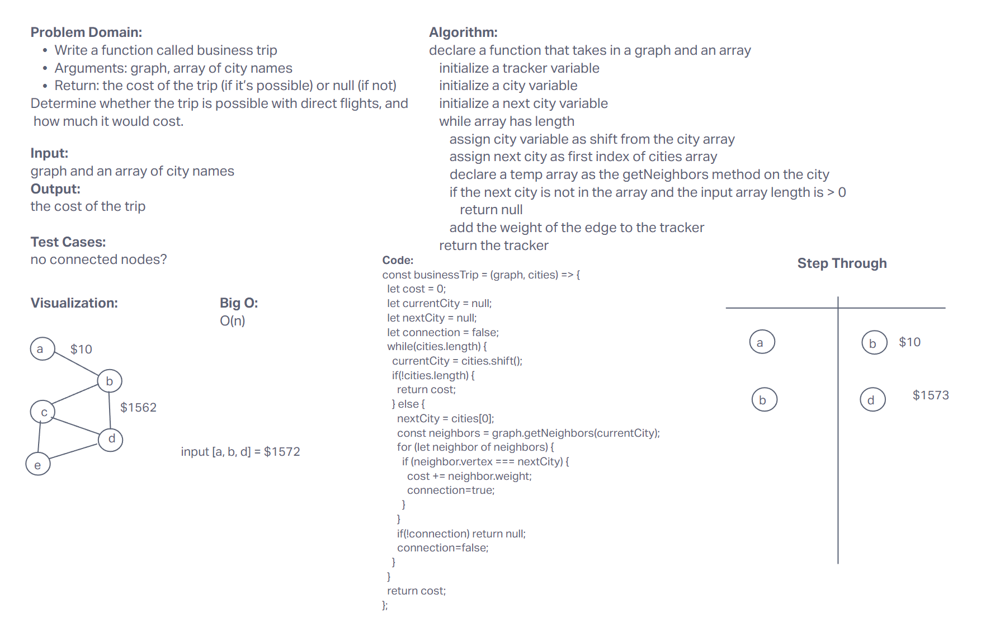
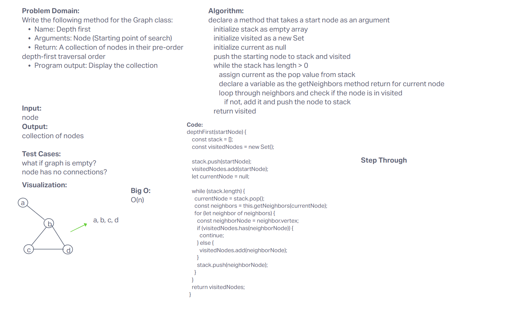
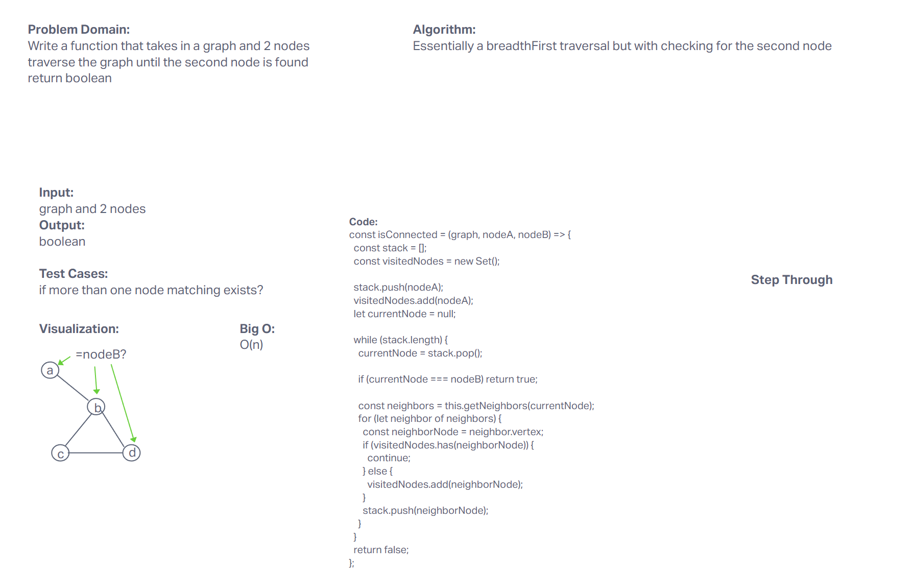

# Graphs

## breadthFirst traversal

## Problem Domain

Write the following method for the Graph class:

breadth first
Arguments: Node
Return: A collection of nodes in the order they were visited.
Display the collection
