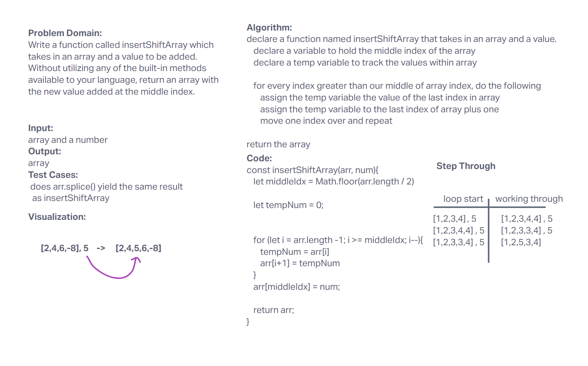

# Insert to Middle of an Array
Write a function called insertShiftArray which takes in an array and a value to be added. Without utilizing any of the built-in methods available to your language, return an array with the new value added at the middle index.

## Whiteboard Process

## Approach & Efficiency
I did pair programming with Jordan, Adrienne, Rafael, and Ken. We took the last index and assigned it to last index plus 1 and then me moved in and did the same.
