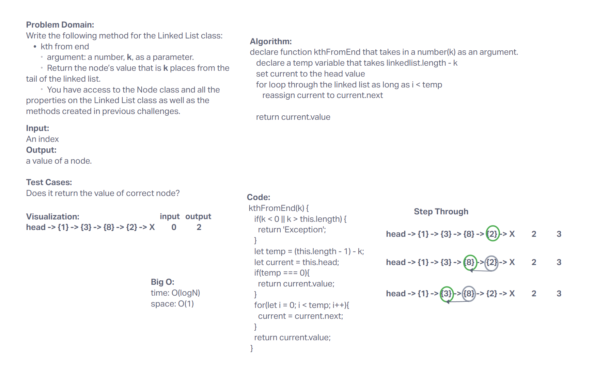

# Singly Linked List
Learning linked lists with friends!

Colab with Jordan, Adrienne, Tyler, Ken, Ash, Martin

## Challenge
Node
Create a Node class that has properties for the value stored in the Node, and a pointer to the next Node.
Linked List
Create a Linked List class
Within your Linked List class, include a head property.
Upon instantiation, an empty Linked List should be created.
The class should contain the following methods
insert
Arguments: value
Returns: nothing
Adds a new node with that value to the head of the list with an O(1) Time performance.
includes
Arguments: value
Returns: Boolean
Indicates whether that value exists as a Node’s value somewhere within the list.
to string
Arguments: none
Returns: a string representing all the values in the Linked List, formatted as:
"{ a } -> { b } -> { c } -> NULL"

## Approach & Efficiency
I dont know what Big O is. I did part of this in class and then finished it in lab time with Jordan and Adrienne.

## API
insert - insert a value

toString - returns a string representing each value in the Linked List

includes - returns true if the value exists in the Linked List

## Whiteboard

