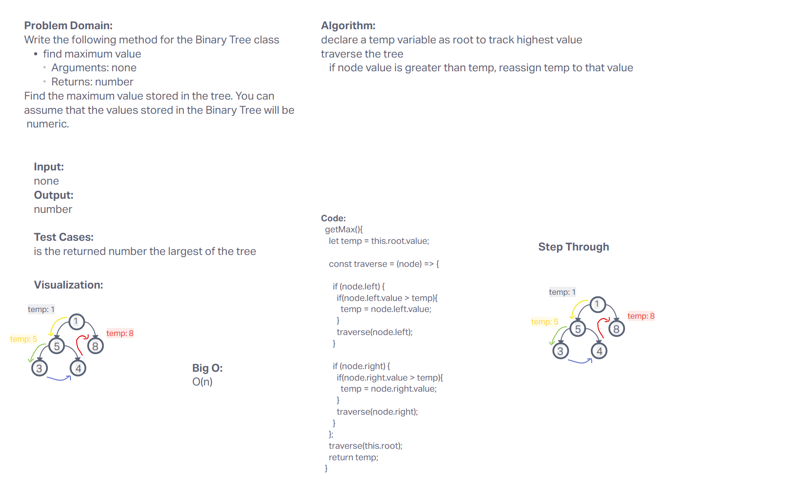
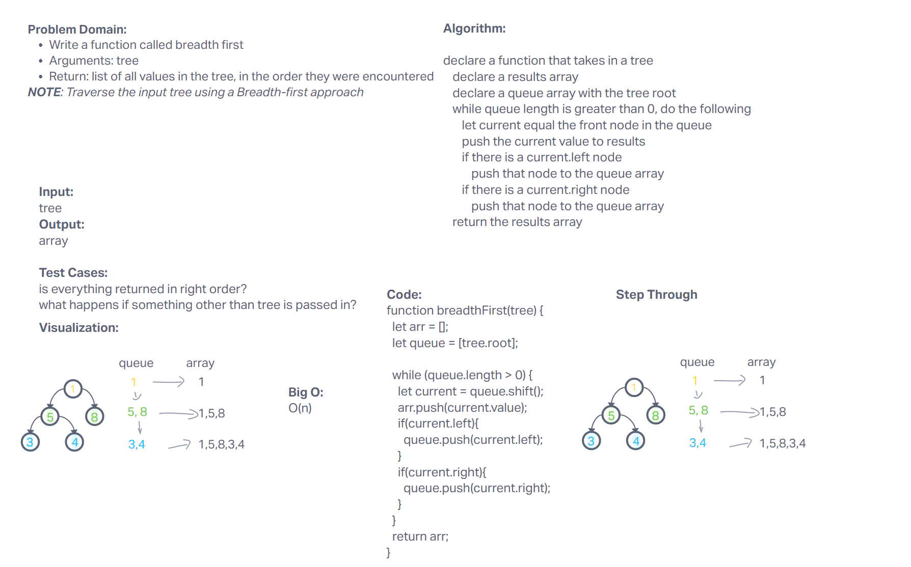

# Stacks and Queues

Colab with Jordan, Adrienne, Ty

## Challenge

Write the following method for the Binary Tree class

find maximum value
Arguments: none
Returns: number
Find the maximum value stored in the tree. You can assume that the values stored in the Binary Tree will be numeric.

Write a function called breadth first
Arguments: tree
Return: list of all values in the tree, in the order they were encountered
NOTE: Traverse the input tree using a Breadth-first approach

## Approach & Efficiency

## API

## Whiteboard

