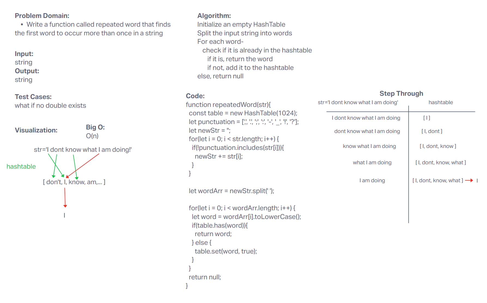
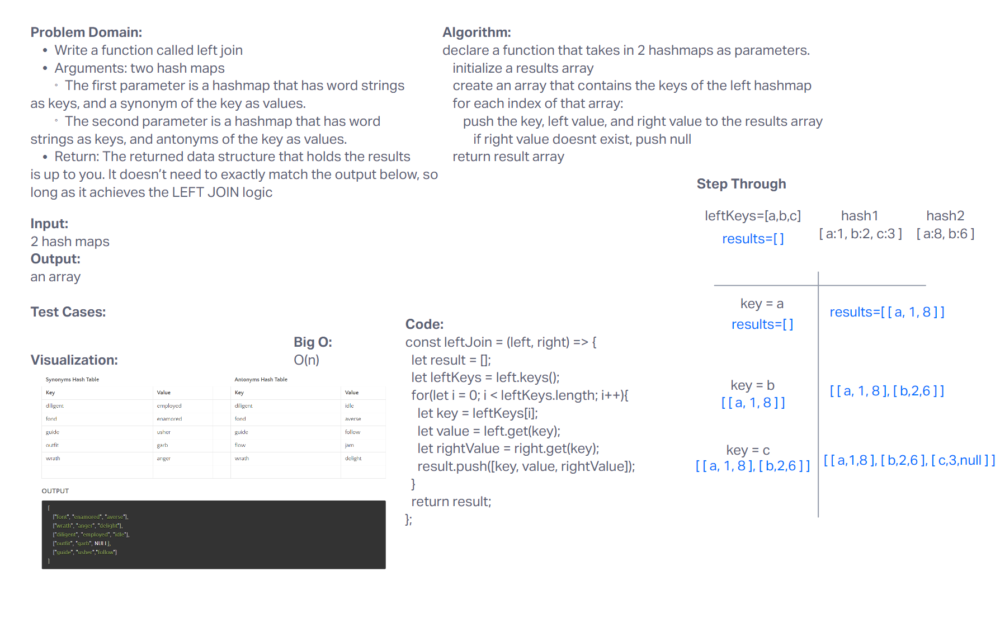

# Hash Tables

Implement a Hashtable Class with the following methods:

- set
  - Arguments: key, value
  - Returns: nothing
  - This method should hash the key, and set the key and value pair in the table, handling collisions as needed.
  - Should a given key already exist, replace its value from the value argument given to this method.
- get
  - Arguments: key
  - Returns: Value associated with that key in the table
- has
  - Arguments: key
  - Returns: Boolean, indicating if the key exists in the table already.
- keys
  - Returns: Collection of keys
- hash
  - Arguments: key
  - Returns: Index in the collection for that key

Write a function called left join
Arguments: two hash maps
The first parameter is a hashmap that has word strings as keys, and a synonym of the key as values.
The second parameter is a hashmap that has word strings as keys, and antonyms of the key as values.
Return: The returned data structure that holds the results is up to you. It doesn’t need to exactly match the output below, so long as it achieves the LEFT JOIN logic

## Approach & Efficiency

We looked through the demo and used ChatGPT to help understand certain aspects of hash tables.

BigO for time is O(1)
BigO for space is O(n)

## Solution

node index.js

For tests: npm run test

## Collaborators

- Adrienne Frey
- Jordan Covington
- John Chavez
