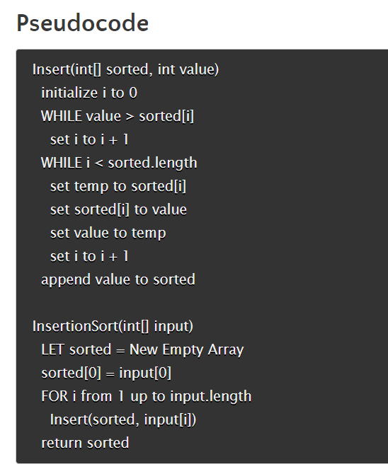
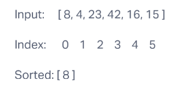
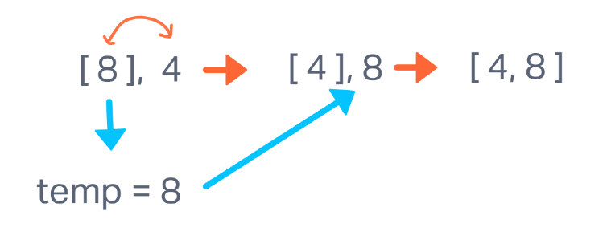
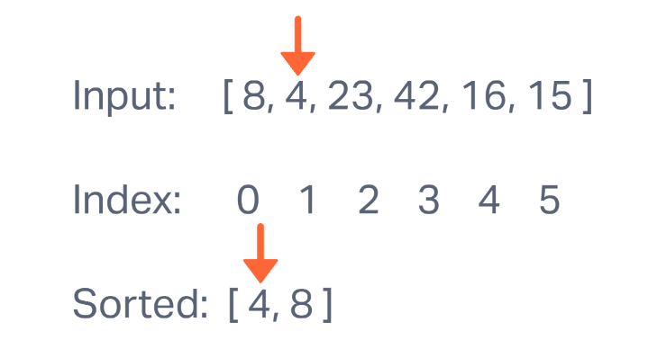

# Blog Notes: Insertion Sort

Sample Array: `[8,4,23,42,16,15]`

The array is passed as a parameter to the InsertionSort function. A new empty array named sorted is declared. The 0 index of sorted is assigned the value of the 0 index of the input array. A loop is then started with `i = 1`, invoking the Insert function with the sorted array and the input array at index of `i`.

## Pass 1

Insert is invoked with the sorted array and input[1] as parameters. In this case, `[ 8 ]` and `4`.

`Insert(sorted, value)`

`i` is initialized to 0. In the first while loop, we check to see if the value is greater than the value of the sorted array at index 0. Since it is not, we will move on to the next while loop.

Since `i` is less than the length of the sorted array, we begin this loop by setting a temp variable to the value of the `sorted` array at index 0. the value of the `sorted` array at 0 is then reassigned to 4. `value` is then reassigned to the value of temp and `i` is incremented by 1(breaking us out of this while loop). `value` (which is now 8) then gets appended to the end of the `sorted` array.

